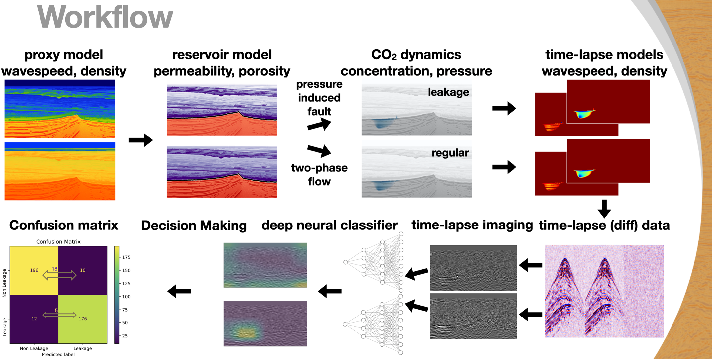
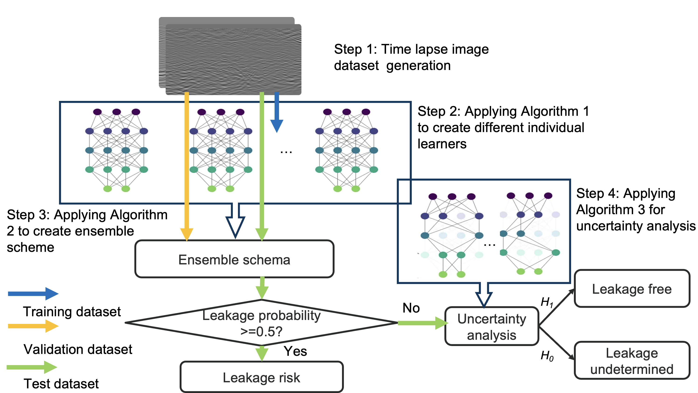

# GCS Leakage Detection

Official PyTorch implementation <br>  
CNN models for CO₂ leakage detection <br> 
This artifact is developed based on the paper  [Ziyi Yin, Huseyin Tuna Erdinc, Abhinav Prakash Gahlot, Mathias Louboutin and F. Herrmann. “Derisking geological carbon storage from high-resolution time-lapse seismic to explainable leakage detection.” The Leading Edge (2023).](https://arxiv.org/pdf/2211.03527) <be>
<br>
Below is the workflow diagram illustrating the detection process:



## Requirements

Python libraries: See [requirements.yml](requirements.yml) for library dependencies. The conda environment can be set up using these commands:

```bash
conda env create -f requirements.yml
conda activate leakage_detection

```
## Training Process

Put the data under the [data](data/) directory, and train the dataset by running the Python script:

```.bash
python scripts/training_loop.py --dataset_path "data/dataset_jrm_1971_seismic_images?dl=0" --data_length 1971 --model_name "vgg16"
```

More details can be found under the notebook [training_demo.ipynb](scripts/training_demo.ipynb).


## Uncertainty Analysis
The multi-criteria decision-making (MCDM)-based Ensemble schema and uncertainty analysis details can be found in [artifacts_demo.ipynb](scripts/artifacts_demo.ipynb)

Below is the uncertainty analysis process:


